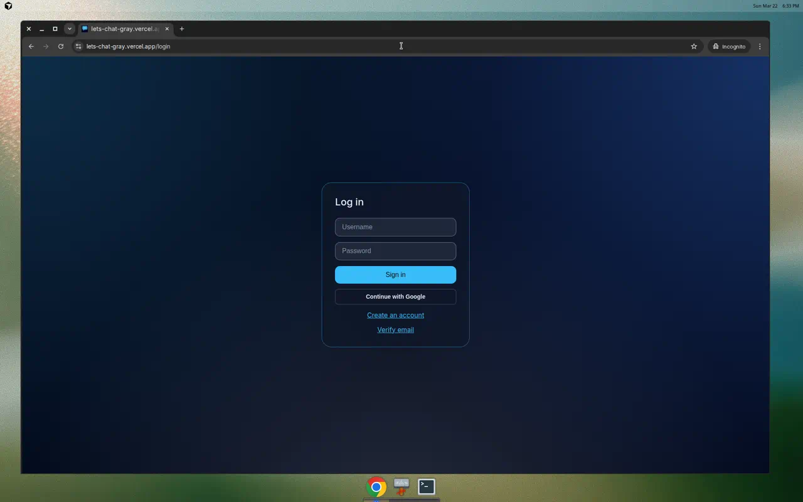
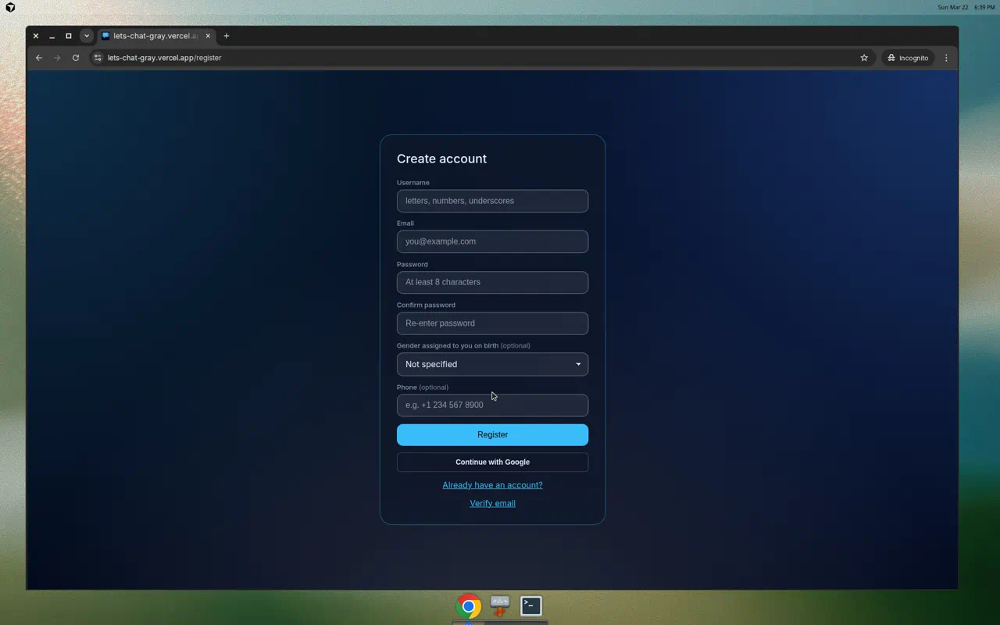
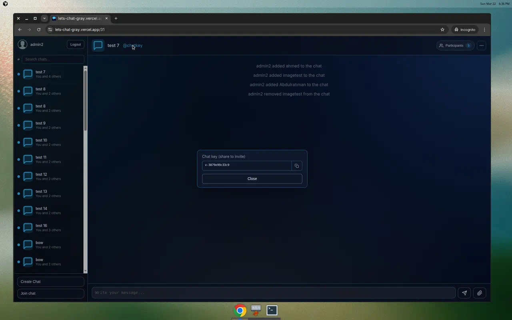
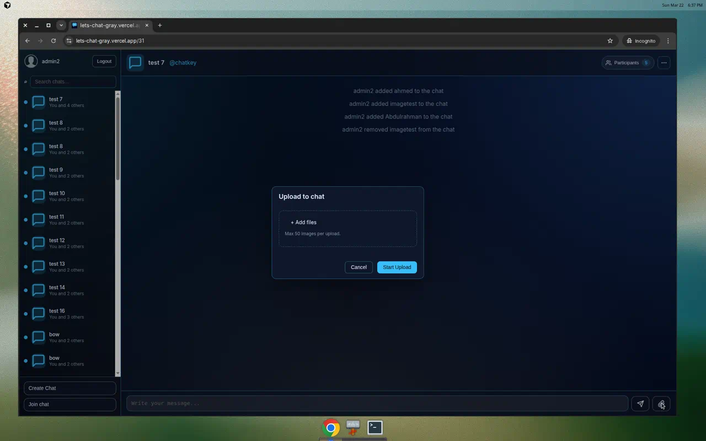
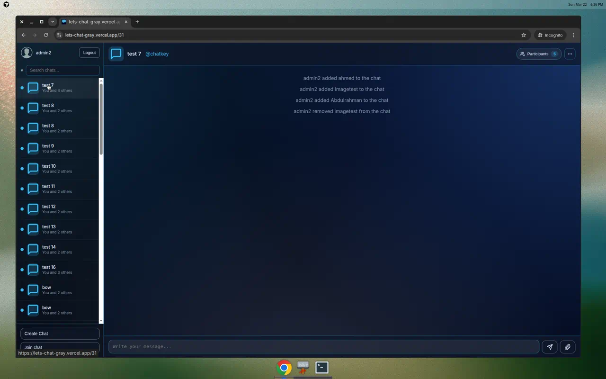
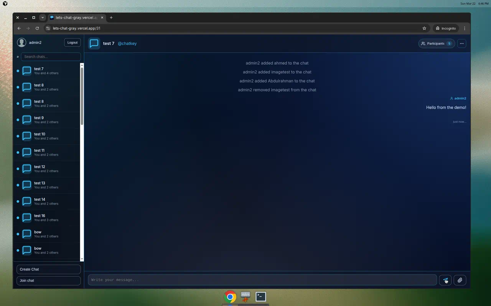
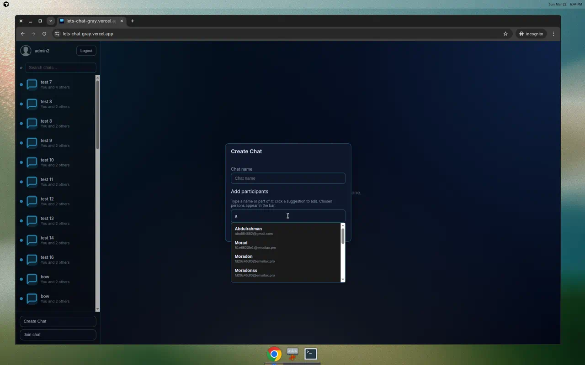
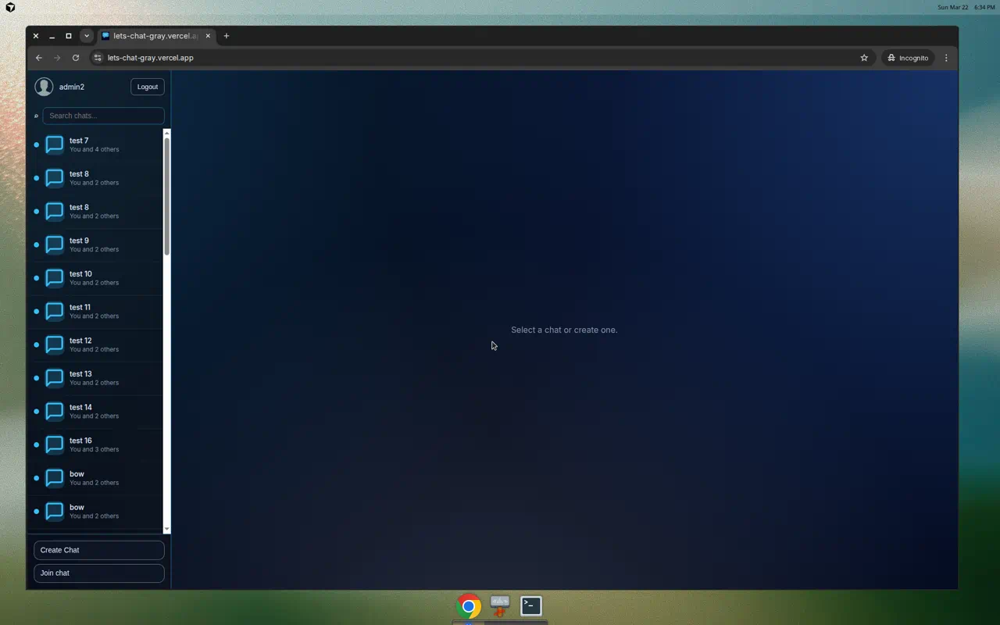
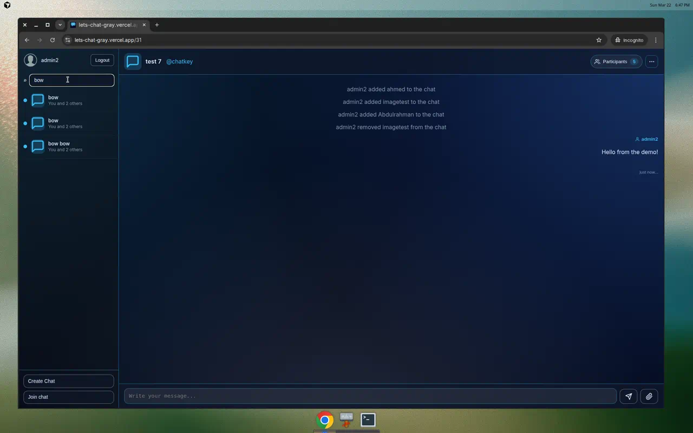
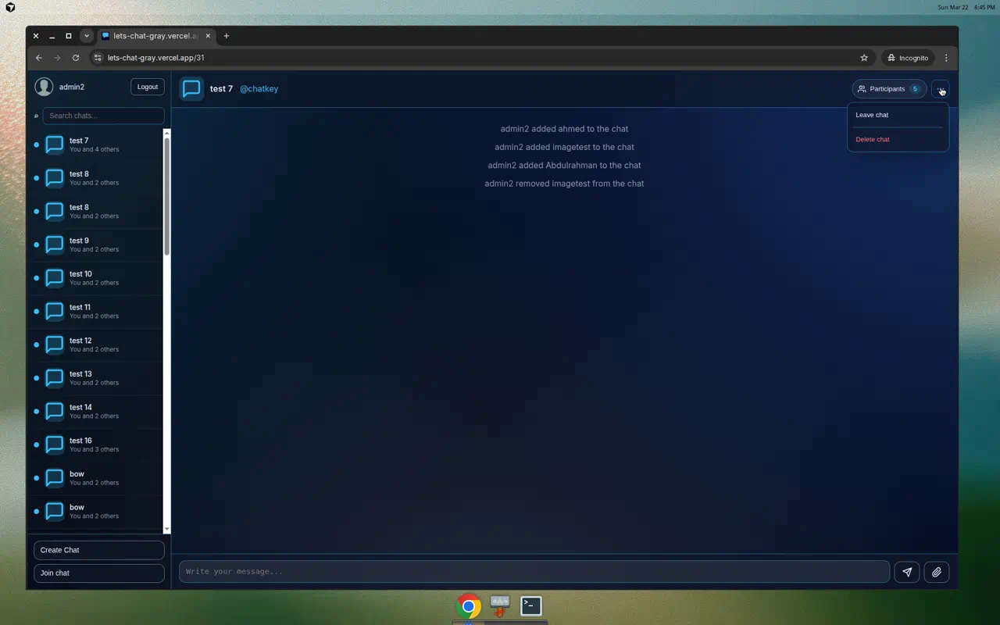

## What this document covers

This log captures **every meaningful change** made during the Lets-Chat refactor, told as the story unfolded. Each entry describes what changed, why, and what it meant for the product. Screenshots from the production deployment at [lets-chat-gray.vercel.app](https://lets-chat-gray.vercel.app) illustrate the result.

**Scope:**

- New SvelteKit app: UI, state management, routing
- WebSocket client architecture
- Backend API additions (search, media, logging)
- Deployment (Dockerfile, Docker Compose)
- Legacy React app status

---

## The starting point

The original Lets-Chat was a Django Channels + React application: a REST API for auth and CRUD, WebSocket for real-time messaging, and a Parcel-bundled React/Redux frontend. The backend worked but the frontend was tightly coupled, hard to extend, and used an older toolchain.

The decision: **rewrite the frontend in SvelteKit 2 (Svelte 5)** while keeping the Django backend and improving it where needed. The React app stays in the repo as a reference but is no longer the active frontend.

---

## 2026-03-14 — Single WebSocket + per-room cache (the foundation)

The very first architectural change — and arguably the most important one.

### What changed

**Backend (`consumers.py`):** The WebSocket consumer was redesigned around a single-connection model. Instead of one WebSocket per chat room (the old approach), clients now open one connection to `ws/chat/` and switch rooms with `join_room` / `leave_room` commands. The consumer tracks `subscribed_rooms` per connection, so a client is always listening to exactly one room but can switch instantly.

**Routing (`routing.py`):** Two URL patterns — `ws/chat/` (generic, no auto-join) and `ws/chat/<room_name>/` (legacy path, auto-joins on connect) — so the old React frontend still works while the new Svelte frontend uses the generic path.

**Frontend (`websocket.ts`):** A singleton WebSocket manager. `connect(roomId)` sends `leave_room` for the current room (if any), then `join_room` for the new one. A pending-message queue buffers anything sent while the socket is still connecting and flushes it on `onopen`. Reconnect uses exponential backoff (1–10 s) and re-joins the last room automatically.

**Store (`message.ts`):** Introduced a per-room cache (`Map<roomId, RoomCache>`) storing messages, participants, admins, name, and chatKey. `setCurrentRoom(roomId)` swaps the reactive stores to the cached data for that room, giving an **instant UI switch** while the network round-trip to fetch fresh messages happens in the background.

### Why

Switching chats was taking 5–10 seconds because the UI was polling for the socket to reach `OPEN` state while the connection was repeatedly opened and closed. Early `load_messages` commands were silently lost.

### Impact

Chat switching is now effectively immediate. The first open fetches from the server; subsequent visits show cached data instantly. The `waitForSocket` polling loop in `ChatRoom.svelte` was removed entirely.

---

## 2026-03-14 — Auth, routing, and the Svelte app skeleton

### What changed

**Auth stores (`auth.ts`):** Token, username, loading, and error as Svelte writables. `setAuth` persists to `localStorage` with an expiration timestamp; `checkAuthState` restores on page load and clears expired sessions. Logout cleans both the store and any stale cookies.

**Auth API (`auth.ts`):** `login`, `register`, `logout` — thin wrappers around `apiRequest` that hit `/rest-auth/login/`, `/rest-auth/registration/`, and `/rest-auth/logout/`. `clearError` resets the error store between form submissions.

**API client (`client.ts`):** A single `apiRequest<T>` function that auto-attaches `Authorization: Token ...` and `X-CSRFToken`, serialises object bodies to JSON, and parses error responses into human-readable messages. Credentials are set to `omit` (token-based, no cookies).

**Routes:** `login/+page.svelte` (dedicated login), `register/+page.svelte` (registration with username, email, passwords, optional gender/phone), and `[[chatId]]/+page.svelte` (the main app — optional `chatId` param, redirects to login if unauthenticated).

**Layout (`+layout.svelte`):** Loads `app.css`, checks auth on mount, wires WebSocket callbacks when a token is present, and auto-logs out on token expiry.


*The login page: glassmorphic card, "Continue with Google" (social auth), links to register and verify email.*


*Registration form: username, email, password with confirmation, optional gender dropdown and phone field.*

### Why

The Svelte app needed its own auth layer that works with token-based auth (no session cookies) and persists across page reloads.

### Impact

Users can register, log in, and have their session restored on refresh. The auth state drives the entire app: no token → login page; valid token → chat interface.

---

## 2026-03-15 — Chat key popup (click to show, copy, feedback)

### What changed

In the original React app, admins could see the chat key via a click-triggered Ant Design Popover. In the first Svelte version, it was only a `title` tooltip on hover — invisible on mobile and impossible to copy.

The fix: clicking `@chatkey` in the chat header opens a modal showing the encrypted key in a read-only field, a copy button (clipboard icon), and a Close button. Copying triggers `navigator.clipboard.writeText` and shows a "Copied!" tooltip above the button for ~2.5 s. Escape or overlay click dismisses the popup. The implementation was later extracted into its own `ChatKeyPopup.svelte` component (see the component split entry below).


*The chat key popup showing the encrypted key, copy button, and Close action. Only visible to admins.*

### Why

The chat key is the only way to invite someone to a private chat. It has to be easy to see and copy.

### Impact

Admins can click `@chatkey`, copy the key, and share it. Non-admins don't see the link. No change to the key generation or encryption logic.

---

## 2026-03-15 — Upload modal: progress bar, file count, and 50-file cap

### What changed

**Frontend (`UploadModal.svelte`):**

- **Cap:** `MAX_FILES_PER_UPLOAD = 50`. Adding files beyond 50 silently drops the extras. Hint text: "Max 50 images per upload."
- **Selected count:** Once files are selected, the hint changes to "X image(s) selected" in accent styling.
- **Progress:** Upload uses `apiFormDataWithProgress` (XHR-based) so `xhr.upload.onprogress` reports 0–100%. While uploading, a progress section shows "Uploading N images — X%" with a progress bar. `uploadPercent` resets when the popup closes or upload finishes.
- **Scroll:** Modal uses `max-height: calc(100vh - 48px)` and `overflow-y: auto` so many files don't overflow the viewport.
- **File list:** Selected files are shown with names and individual remove (×) buttons.

**API client (`client.ts`):** Added `apiFormDataWithProgress(endpoint, formData, onProgress?)` using `XMLHttpRequest` for progress reporting. The old `apiFormData` wrapper was later removed as unused.

**Backend (`settings.py`):** `DATA_UPLOAD_MAX_NUMBER_FILES = 50` — the backend enforces the same limit.


*The upload modal with the dashed drop zone, "+ Add files" button, 50-image cap hint, and Cancel/Start Upload actions.*

### Why

The backend enforces a 50-file limit. Without frontend feedback, users would hit a cryptic server error. The progress bar gives confidence during large uploads.

### Impact

Users see selected count, max limit, upload progress, and a scrollable modal. They cannot submit more than 50 files in one request.

---

## 2026-03-15 — Fullscreen image viewer and download

### What changed

Chat images in the message timeline became clickable. Clicking opens a fullscreen overlay with the image centred, a download icon button, and an X (close) button. Download uses the backend endpoint `GET /chat/media/download/?file=<mediaPath>` via a hidden iframe so the browser triggers a file-save dialog instead of opening the image in a new tab.

`expandedImage` state holds `url`, `filename`, and `mediaPath`. The same viewer is used from both the timeline and the gallery (see below).

**Backend (`api/views.py`):** Added `MediaDownloadView` — a `GET` endpoint that resolves the file under `MEDIA_ROOT`, validates the path (no `..` traversal), and returns a `FileResponse` with `Content-Disposition: attachment`.

### Why

Users wanted a proper fullscreen view and reliable download. Fetching cross-origin images and opening them in a new tab was unreliable; the backend download endpoint guarantees an attachment response.

### Impact

View and download work consistently. The viewer is shared between the timeline and the image gallery.

---

## 2026-03-15 — WhatsApp-style image groups and gallery

### What changed

**Grouping:** Consecutive image-only messages from the same author are rendered as a single block. The `messageBlocks` derivation classifies blocks as `system`, `single`, or `imageGroup`.

**Grid in timeline (`MessageBlock.svelte`):** Image groups show up to 4 thumbnails in a 2×2 grid. Three images use one large + two small. Groups with more than 4 images show a "+N" overlay on the 4th cell (e.g. "+8" for 12 images). Sent groups align right (`margin-left: auto`); received groups align left.

**Gallery popup (`ImageGallery.svelte`):** Clicking an image group opens a scrollable fullscreen gallery listing all images in that group as a grid of thumbnails. The header shows "N images" and a Close (X) button. Clicking a thumbnail opens the single-image fullscreen viewer. Closing the viewer returns to the gallery — the gallery stays open so users can browse more images from the same group.

### Why

Match WhatsApp-style presentation when many images are sent in a batch: one compact block with preview and count, expandable to browse all.

### Impact

Fewer list items for multi-image bursts; sent/received alignment is correct; gallery and viewer coexist without conflicting close behaviour.

---

## 2026-03-15 — ChatRoom split into smaller components

### What changed

`ChatRoom.svelte` was ~910 lines and growing. It was split into:

| Component | Responsibility |
|---|---|
| `ChatKeyPopup.svelte` | Chat key modal, copy + "Copied!" tooltip |
| `ImageViewer.svelte` | Fullscreen image + download |
| `ImageGallery.svelte` | Group image gallery popup |
| `ConfirmModal.svelte` | Leave / delete confirmation dialog |
| `MessageBlock.svelte` | System / single / imageGroup rendering and styles |
| `$lib/utils/format.ts` | `formatMessageTimestamp` — human-readable timestamps ("just now", "2 min ago", etc.) |

`ChatRoom.svelte` now composes these components and keeps only layout (contact-profile header, messages area, message input bar), placeholder states, message-block derivation, and escape-key handling.

### Why

Minimum file size, clearer separation of concerns. Each modal and the message block have their own file and styles; `ChatRoom` stays focused on room state and composition.

### Impact

Easier to maintain and test. No behaviour change for the user.

---

## 2026-03-15 — Chat header icon, send and attach SVG icons

### What changed

**Chat header (`ChatRoom.svelte`):** Replaced the generic placeholder with a chat-bubble SVG icon in a rounded accent-coloured container. The chat name uses a `.chat-name` span with bolder font and stronger colour for visibility.

**Message input bar:** The plain text "Send" and "Attach" labels were replaced with proper SVG icons — a paper-plane for send and a paperclip for attach — matching modern chat app conventions.


*The chat room showing: chat bubble icon in the header, chat name "test 7", @chatkey link, Participants badge, three-dots menu, system messages, and the message input bar with send (paper-plane) and attach (paperclip) icons.*

### Why

Visual polish — the header and input bar should feel like a real chat app, not a prototype.

### Impact

Purely visual. No functional change.

---

## 2026-03-15 — Sender icons and coloured names in messages

### What changed

**MessageBlock.svelte:**

- Sender names now show a small user/avatar SVG icon beside the name.
- Sent messages (you): accent blue (`#38bdf8`).
- Other participants: a stable colour chosen from a 12-colour palette based on a hash of their username. The palette and hash ensure the same user always gets the same colour within a chat and different participants get different colours.
- Left-chat users: a muted grey (`--Text-Heading-Medium`).
- The name row uses distinct CSS classes (`name-sender`, `name-reciever`, `name-out`) with slightly larger, bolder text.


*A sent message showing "admin2" in accent blue with a user icon, the message text, and a "just now..." timestamp.*

### Why

In a group chat with many participants, names need to be visually distinct and easy to scan. Colour-coding by username is the standard approach (Slack, WhatsApp, Discord).

### Impact

Sent vs received vs left-chat is immediately clear by colour and icon. Different participants are colour-distinct within a chat.

---

## 2026-03-15 — Chat bubble icon in sidebar and favicon

### What changed

**Sidepanel.svelte:** Each chat in the sidebar now shows a chat-bubble SVG icon (matching the header icon) instead of a generic placeholder.

**Favicon (`favicon.svg`):** Replaced the default SvelteKit favicon with a custom chat-bubble SVG. An SVG path issue (`h- .5` with a stray space) was later fixed so strict parsers render it reliably.

### Why

Visual consistency — the same chat-bubble motif appears in the favicon, sidebar, and chat header.

### Impact

The browser tab shows the chat bubble icon. The sidebar list is visually consistent with the chat header.

---

## 2026-03-16 — Chat open scrolls to latest messages (no smooth scroll)

### What changed

**ChatRoom.svelte:** Scroll-to-bottom on message load now uses `await tick()` so the scroll runs after the message list DOM is updated, and uses `scrollIntoView({ behavior: 'auto' })` instead of `behavior: 'smooth'`.

### Why

Opening a chat was starting at the first message and smooth-scrolling down to the last. In a chat with hundreds of messages, this felt broken — users expect to see the most recent messages immediately, like any real chat app.

### Impact

Initial open shows last messages in view instantly. New messages still scroll to bottom without animation.

---

## 2026-03-16 — User search typeahead API

### What changed

**Frontend API (`chat.ts`):** Added `searchUsers(q, limit)` — calls `GET /chat/users/search/?q=...&limit=...` and returns `UserSearchHit[]` (`id`, `username`, `email`).

**Backend (`user_search.py`):** A pluggable search backend. When `USER_SEARCH_BACKEND=opensearch` and `OPENSEARCH_URL` is set, it queries OpenSearch with fuzzy match, phrase prefix, and email wildcard. On any error (or when OpenSearch is not configured), it falls back to `_search_users_db` which uses Django ORM `Q(username__icontains=q) | Q(email__icontains=q)`. Both return `[{"id", "username", "email"}]`.

**Backend (`api/views.py`):** `UserSearchView` — accepts `q` (search text) and `limit` (default 20, max 50), delegates to `search_users()`.

**Management command (`opensearch_index_users.py`):** Creates the OpenSearch index with mappings for `id`, `username`, `email` and indexes all existing users. Exits early if `OPENSEARCH_URL` is not set.

### Why

The Create Chat and Add Member modals needed to find users by partial name or email. The dual-backend approach means the feature works out of the box (DB fallback) but can scale with OpenSearch in production.

### Impact

Any modal that needs to find users now has a fast, debounced search API.

---

## 2026-03-16 — User search typeahead in Add Member and Create Chat modals

### What changed

**AddMemberModal.svelte and CreateChatModal.svelte:** Both modals got a unified participant search flow:

1. A single search input with placeholder "e.g. charlie or cha".
2. 120 ms debounced typeahead that queries `searchUsers`.
3. Dropdown showing matching users (username + email).
4. Clicking a suggestion adds it as a removable chip.
5. Results exclude already-selected participants (and in Create Chat, the current user).
6. The old "Contacts (usernames, comma-separated)" text field was removed.

A generic form rule for `input[type='text']` was updated to exclude `.search-input` so the participant search uses only the inline bar styling (chips + input inside one bar), fixing a "two bars" look.


*The Create Chat modal showing the typeahead dropdown: typing "a" reveals matching users (Abdulrahman, Morad, etc.) with their emails.*

### Why

Users need fast search to find and add participants. A single search + chips UX avoids confusion between "search" and "contacts" fields.

### Impact

One clear field for finding and adding users. Selected list is visible as chips and editable (remove via ×).

---

## 2026-03-16 — Unified modal width

### What changed

`app.css` gained `--modal-width: min(420px, 92vw)` in `:root`. All modals — CreateChatModal, AddMemberModal, JoinChatModal, KickMemberModal, ChatKeyPopup, ConfirmModal, UploadModal — now use `width: var(--modal-width)` and `max-width: var(--modal-width)`. `min-width` was removed so width is fixed and consistent.

### Why

Different popups had different widths, which felt inconsistent when opening them in sequence. A single CSS variable ensures every popup is the same width at every screen size.

### Impact

All modals share one responsive width. No resizing between popups.

---

## 2026-03-16 — Dockerfile and .dockerignore for production deployment

### What changed

**Dockerfile:** Python 3.12 slim image. Installs `requirements.txt`, copies `src/`, runs `collectstatic`, and starts with `python manage.py migrate --noinput && exec daphne -b 0.0.0.0 -p ${PORT:-8000} Justchat.asgi:application`.

**docker-compose.yml:** A single Redis service (`redis:7-alpine` on port 6379, append-only disabled) for the channel layer. The Django app runs outside Docker (or in a separate compose file / hosting platform).

**.dockerignore:** Excludes `.git`, `app-svelte`, `docs`, `node_modules`, `.env`, `*.md`, `*.sqlite3`, `__pycache__`, logs, and test artefacts.

### Why

The backend needed to be containerised for deployment to Northflank (or any container platform). The Svelte frontend deploys separately to Vercel.

### Impact

`docker build` produces a production-ready image. `docker compose up -d redis` starts the channel layer.

---

## 2026-03-17 — Shared UserSearchBar, modal reset, favicon fix, and API cleanup

### What changed

**UserSearchBar.svelte:** Extracted ~90 lines of duplicated search logic and styles from `CreateChatModal` and `AddMemberModal` into a single reusable component. It accepts an `exclude` list so existing chat members and the current user are never suggested. Both modals import it and wire only the props they need.

**Modal reset:** Both `CreateChatModal` and `AddMemberModal` now use `$effect` to reset their `$state` (selected participants, error, loading) when the popup closes, matching `ChatKeyPopup`'s cleanup behaviour. This fixes stale state across modal open/close cycles.

**Favicon SVG fix:** The path `h- .5` (with a stray space) was corrected to `h-.5` so strict SVG parsers render it correctly.

**API cleanup:** The obsolete `apiFormData` wrapper was removed from `client.ts`. Only `apiFormDataWithProgress` remains.

### Why

Avoided duplicated logic/styles, fixed stale state bugs, ensured users cannot see already-added participants in suggestions, and cleaned up dead code.

### Impact

Participant search UX is consistent and resilient across modals. The favicon renders correctly in all browsers. The API client surface area stays minimal.

---

## 2026-03-17 — Frontend logging to backend

### What changed

**Frontend (`logger.ts`):** A `logger` object with `debug`, `info`, `warn`, `error` methods. Each call POSTs to `/chat/logs/frontend/` with `level`, `message`, and optional `context`. In development, it also logs to the browser console. Calls are fire-and-forget (errors are silently caught).

**Backend (`api/views.py`):** `FrontendLogView` receives the log payload and routes it to Python's `frontend` logger (configured with a rotating file handler at `logs/frontend.log`).

**Backend (`settings.py`):** Logging config with four handlers — `console`, `file_django`, `file_chat`, `file_frontend` — each using `RotatingFileHandler` (5 MB × 3 backups). Loggers: `django`, `channels`, `chat`, `frontend`.

### Why

Frontend errors were invisible. With this, both client-side and server-side logs are in one place (server log files), making debugging production issues possible.

### Impact

Login success/failure, WebSocket events, and any frontend error are logged to `logs/frontend.log` on the server.

---

## 2026-03-17 — Seed command for demo data

### What changed

**Management command (`seed_chat_data.py`):** `python manage.py seed_chat_data` creates 8 demo users (alice, bob, charlie, diana, eric, fatima, george, hana — password: `password`), their `Contact` objects, 5 chats with random participants/admins, ~40 messages per chat (including ~1-in-6 as images), system messages for creation and joins, and prints login credentials and chat keys.

Options: `--chats N`, `--messages N`, `--force` (clears existing chats/messages before reseeding).

### Why

A fresh database has no data. The seed command gives a working demo with multiple users, chats, images, and activity history for testing and screenshots.

### Impact

Running `python manage.py seed_chat_data` populates the database with realistic demo data.

---

## The Sidepanel and main layout


*The main interface after login: admin2's profile with avatar and Logout button, search bar filtering chats, scrollable chat list with chat-bubble icons and participant counts, and Create Chat / Join chat buttons at the bottom.*

**Sidepanel.svelte** handles:

- User profile display (username, avatar, Logout).
- Chat list loaded via `getChats` when auth state changes.
- Search filtering via a `$derived` store that filters the chat list by name.
- Navigation: clicking a chat navigates to `/{chatId}`.
- Action buttons: "Create Chat" and "Join chat" open their respective modals via the `nav` store.


*Typing "bow" in the search bar filters the chat list to only matching chats.*

---

## Modal inventory

All modals share the same fixed overlay pattern and `--modal-width`.

| Modal | Trigger | Purpose |
|---|---|---|
| **CreateChatModal** | "Create Chat" button | Name + participant search → creates chat, refreshes list, navigates to room |
| **JoinChatModal** | "Join chat" button | Paste chat key → joins chat, refreshes list, navigates to room |
| **AddMemberModal** | (Programmatic, from chat actions) | Search + add participants as Participant or Admin role |
| **KickMemberModal** | (Programmatic, from chat actions) | Checkbox list of members to remove; prevents removing all |
| **UploadModal** | Attach (paperclip) icon in message bar | Multi-file image upload with progress |
| **ConfirmModal** | Leave / Delete actions | Generic "Are you sure?" with OK/Cancel |
| **ChatKeyPopup** | `@chatkey` link in header | Show and copy encrypted chat key |


*The Create Chat modal: name input, participant search bar with "e.g. charlie or cha" placeholder, and Start New Chat button.*


*The Join Chat modal: paste the encrypted chat key, then Join.*


*The upload modal: dashed drop zone, 50-image cap, Cancel / Start Upload.*

---

## Chat actions dropdown


*The three-dots menu in the chat header showing "Leave chat" and "Delete chat" (red). Add Member and Kick Member actions are available programmatically when the user is an admin.*

---

## State management summary

| Store | Contents | Key patterns |
|---|---|---|
| `auth.ts` | `token`, `username`, `loading`, `error` | localStorage sync, expiration, cookie cleanup |
| `message.ts` | `messages`, `participants`, `chatName`, `admins`, `chatKey`, `chats` | Per-room `Map` cache; `setCurrentRoom` swaps reactive stores |
| `nav.ts` | Boolean flags for each modal | `open*` / `close*` helpers |

---

## Component inventory (final state)

| Component | Lines | Purpose |
|---|---|---|
| `ChatRoom.svelte` | ~250 | Room layout, WS connection, message sending, block derivation |
| `Sidepanel.svelte` | ~200 | Chat list, profile, search, navigation |
| `MessageBlock.svelte` | ~220 | Renders system / single / imageGroup blocks with coloured names |
| `UserSearchBar.svelte` | ~206 | Reusable debounced search with chips |
| `CreateChatModal.svelte` | ~120 | Create chat form |
| `AddMemberModal.svelte` | ~130 | Add member with role selection |
| `KickMemberModal.svelte` | ~90 | Kick member checkbox list |
| `UploadModal.svelte` | ~130 | Multi-file upload with progress |
| `JoinChatModal.svelte` | ~70 | Join via chat key |
| `ChatKeyPopup.svelte` | ~180 | Show/copy chat key |
| `ImageViewer.svelte` | ~100 | Fullscreen image + download |
| `ImageGallery.svelte` | ~128 | Group image gallery |
| `ConfirmModal.svelte` | ~58 | Leave/delete confirmation |
| `LoginInline.svelte` | ~80 | Inline login form (used on main page when unauthenticated) |
| `ChatSheet.svelte` | ~120 | AI chat sheet (built for future use, not wired to routes) |

---

## API surface (frontend → backend)

| Endpoint | Method | Used by |
|---|---|---|
| `/rest-auth/login/` | POST | `auth.ts` → login |
| `/rest-auth/registration/` | POST | `auth.ts` → register |
| `/rest-auth/logout/` | POST | `auth.ts` → logout |
| `/chat/` | GET | `chat.ts` → getChats (with `?username=` filter) |
| `/chat/create/` | POST | `chat.ts` → createChat |
| `/chat/<id>/update/` | PUT | `chat.ts` → leaveChat, kickMembers, addParticipants |
| `/chat/<id>/delete/` | DELETE | `chat.ts` → deleteChat |
| `/chat/join/` | POST | `chat.ts` → joinChat (encrypted key) |
| `/chat/upload/` | POST | `chat.ts` → uploadToChat (FormData + XHR progress) |
| `/chat/users/search/` | GET | `chat.ts` → searchUsers (`?q=&limit=`) |
| `/chat/media/download/` | GET | `ImageViewer.svelte` → file download |
| `/chat/logs/frontend/` | POST | `logger.ts` → frontend log forwarding |

---

## WebSocket protocol

| Command | Direction | Payload |
|---|---|---|
| `join_room` | client → server | `room_id` |
| `leave_room` | client → server | `room_id` |
| `new_message` | client → server | `from`, `chatId`, `message` |
| `load_messages` | client → server | `chatId`, `msgCount`, `username` |
| `messages` | server → client | `messages[]`, `participants`, `admins`, `name`, `chatKey`, `room_id` |
| `new_message` | server → client | `message` object (broadcast to group) |
| `chatsUpdate` | server → client | (no payload — signal to refetch chat list) |

---

## What did not change

- **Legacy React frontend** (`frontend/`): still in the repo, still works with the backend, but is not the active frontend. No changes were made during this refactor.
- **Django models** (`models.py`): `CustomUser`, `Contact`, `Message`, `Chat` — unchanged.
- **Core serializers** (`serializers.py`): `ChatSerializer`, `CustomRegisterSerializer` — unchanged except for Fernet key derivation from `settings.CHAT_FERNET_KEY`.
- **Django admin** (`admin.py`): unchanged.

---

## Deployment architecture

```
┌─────────────────┐     HTTPS      ┌──────────────────┐
│  Vercel (CDN)   │ ◀────────────▶ │    Browser        │
│  SvelteKit SSR  │                │                    │
└─────────────────┘                └──────┬─────────────┘
                                          │ REST + WS
                                          ▼
                                   ┌──────────────────┐
                                   │  Northflank /     │
                                   │  Docker container │
                                   │  Daphne (ASGI)   │
                                   │  port 8000       │
                                   └──────┬───────────┘
                                          │
                                   ┌──────▼───────────┐
                                   │  Redis 7         │
                                   │  Channel layer   │
                                   └──────────────────┘
```

- **Frontend:** SvelteKit on Vercel. `VITE_API_BASE_URL` and `VITE_WS_BASE_URL` point to the backend.
- **Backend:** Django + Daphne in a Docker container. `REDIS_URL` for channel layer; falls back to `InMemoryChannelLayer` for local dev.
- **Database:** SQLite for local dev; PostgreSQL via `DATABASE_URL` in production.
- **Search:** OpenSearch via `OPENSEARCH_URL` with DB `icontains` fallback.
